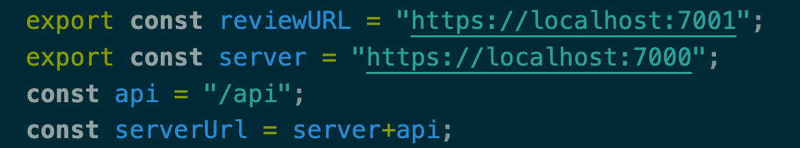
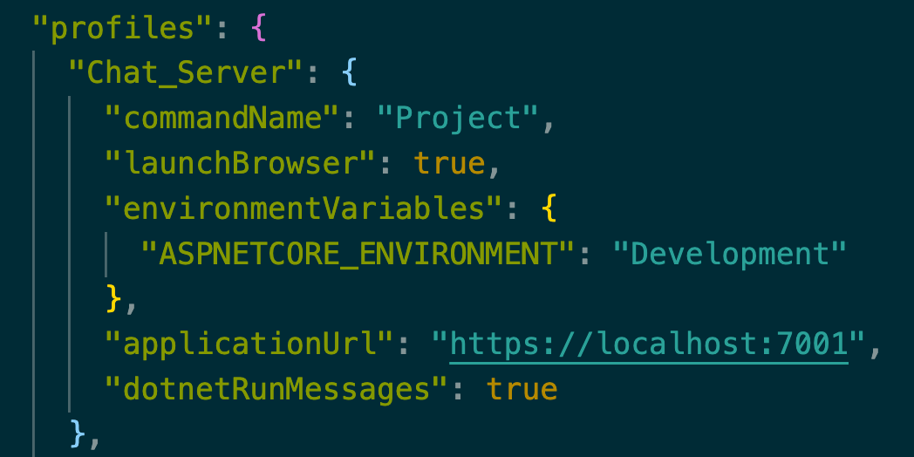
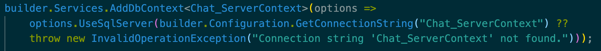
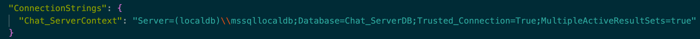

# Talk To Me Bro
This is the submition of assignment 2. In order to access the code written for the submition of assignment 1
Switch to the branch 'main'.
## Getting Started
### Chat UI - React
The chat UI runs on port 3000.
In order to run the react app correctly you must first install and build the project.
Run the following commands in the terminal:
```bash
npm install
npm build
# Or
yarn install
yarn build
```
To run the app, run the following command:
```bash
npm start
# or
yarn start
```
#### Connecting to the Server
Inside the react project you can find a file named "fetch.js".
This file defines the methods and need information in order to connect the app to the sever.
In order to change the base URL you must change the following variable:



### Chat Server and WebAPI - C#
The chat server runs on port 7001 and the WebAPI runs on port 7000.
In order to change the port(s), you can change the file Properties/launchSettings.json:



In this project we used the local SQL server supported by the Windows OS.
In order to change the server you should change the DbContext service defined in the 'Program.cs' file:

In the case of changing the DbContext, you must define its connection string.
The string connection can be found in appsettings.json file of the project:

Each project has its own files, make sure to apply changes to each project
## Authors
Idan Ziv
Guy Aronson
