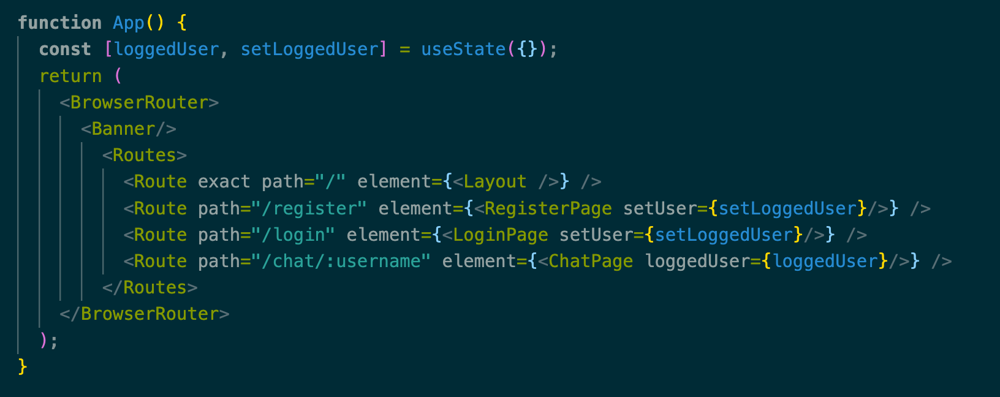
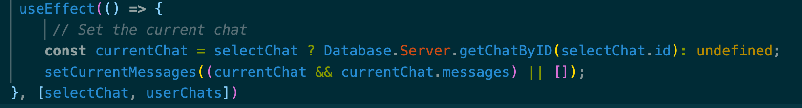

# Talk To Me Bro


## Installation and getting started
1) First make sure you have react install on your device
2) Clone the repo by running the next command in your terminal:
```bash
git clone git@github.com:GuyAronson/Chat.git
```
3) Open the terminal and enter the chat's directoty and run the following command
```bash
npm install
npm build
# or
yarn install
yarn build
```
4) After the install and build phases have completed succesfully run the following command, to run the app in your browser
and then again:
```bash
npm start
#
yarn start
```


## App's Capabilities

The app, as of for now, consists of 3 main pages:
1) Login page - a standard login page for exsiting users
2) Register page - a standard register page for new users
3) Chat - the main page of the app

The engine of the app is in the Database files, further description will appear down below.

**NOTE: -**
This current version only support the client side of the app. For that reason all the chats and users are hardcoded to a local Server (called DataBase).
For this reason the chat will return to the hardcoded state upon refreshing the page.

### Registration
The registration page requests the user for basic information (username, password, nickname etc.) and runs multiple validation checks:
*Crossing the data with the existing users in the server.
*Email and password matching checks

### Login
A standard login page who query the server for the existing username and password


note that you WONT be able to add unregistered user or your user of course.

### Chat

As of now, the chat supports the following types of messages:
1) Text
2) Image
3) Video
4) Audio

## Dependencies
* react-bootstrap
* react-router-dom


## React Features Used
### React Hooks
In React, hooks are a new feature that enables you control and manipulate state and other features without the use of classes.
The hooks were helpful to when we needed to share information between different componenets of the app:

We used the useState hook to pass the logged user to the Chat page:


We also used the useEffect to render the app on the events of sending a message or changing/adding a chat:


### React Routes

React Router is a React library that help us support loading of new pages of the app without the need of refreshing.
This came helpful when navigation between different parts of the app was need

## Database - Preparing for the next building block

Although at this phase we only built the client side of the app we knew that it was going to communicate with a server.
For this reason we built a "fake" server side to work with.
The database describes the data structures the client-side should work with:
* Chat
* Message
* User

As a result the client side is not aware of the way it recives and sends information, which allow us to replace the server to anything we would like
in the future without, hopefully, having to change the code.

## Authors
Idan Ziv
Guy Aronson
